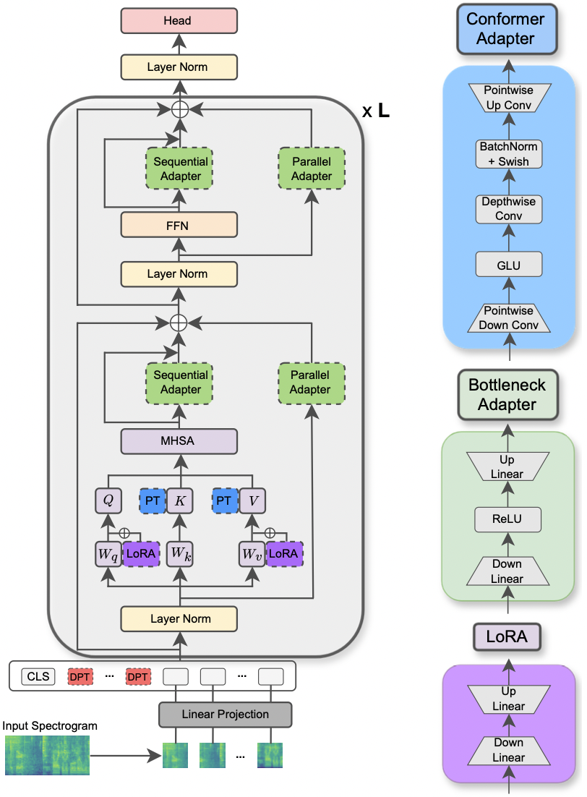
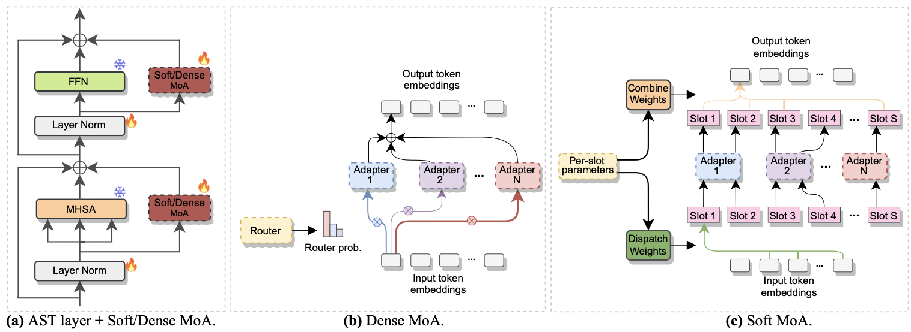

This repository contains the official code of the papers: **[Parameter-Efficient Transfer Learning of Audio Spectrogram Transformers](https://arxiv.org/abs/2312.03694)** :rocket: **[1]** (**accepted for publication at the 2024 IEEE MLSP Workshop**)  and **[Efficient Fine-tuning of Audio Spectrogram Transformers via Soft Mixture of Adapters](https://arxiv.org/abs/2402.00828)** :fire: **[2]** (**accepted for publication at Interspeech 2024**). 

Both papers study how to apply parameter-efficient transfer learning (*PETL*) methods to the Audio Spectrogram Transformer (AST) model for various audio/speech downstream tasks. Whereas **[1]** provides a comprehensive overview of PETL methods (prompt-tuning, LoRA, adapters) under different scenarios and constraints, **[2]** explores how to efficiently harness the Mixture of Experts architecture for PETL. 

Below we include all the details to replicate our results.

---

<div align="center">

[](https://umbertocappellazzo.github.io/)
[](https://arxiv.org/abs/2312.03694)

# Parameter-Efficient Transfer Learning of Audio Spectrogram Transformers

[Umberto Cappellazzo](https://umbertocappellazzo.github.io/), [Daniele Falavigna](https://scholar.google.com/citations?user=LEaCpUMAAAAJ&hl=en), [Alessio Brutti](https://scholar.google.it/citations?user=dS643iQAAAAJ&hl=en), [Mirco Ravanelli](https://sites.google.com/site/mircoravanelli/)

</div>

**The paper has been accepted at the 2024 IEEE MLSP Workshop**. This paper explores the use of different **PETL** methods applied to the Audio Spectrogram Transformer model for various audio and speech processing tasks. Furthermore, we propose a new adapter design that exploits the convolution module of the Conformer model, leading to superior performance over the standard PETL approaches and surpassing or achieving performance parity with full fine-tuning by updating only 0.29% of the parameters.


<div align="center">

|         |
| :-------------------------------------------------: |
| **Illustration of the AST model and the PETL methods.** |


</div>


## Environment setup
The requested libraries for running the experiments are listed in the requirements.txt file. Run the command below to install them.   

```
pip install -r requirements.txt
```

I use weights and biases (https://wandb.ai/site) for tracking my experiments (I warmly recommend it). Nonetheless, you can deactivate it by setting `--use_wandb = False` in the command line.

I expect that the user has already downloaded the datasets by him/herself.


# Running an experiment

To run an experiment, everything you need is to use the command ``` python3 main.py ``` followed by some arguments passed on to the command line to specify the setting. The mandatory parameters are:

- `--data_path`: the path to the folder containing the dataset. 
- `--dataset_name`: the selected dataset. As of now, 5 datasets are available: `['FSC', 'ESC-50', 'urbansound8k', 'GSC', 'IEMOCAP']`. 
- `--method`: the selected PETL method. A list of supported PETL methods follows: `['linear', 'full-FT', 'adapter', 'prompt-tuning', 'prefix-tuning', 'LoRA', 'BitFit', 'Dense-MoA', 'Soft-MoA']`. Please check out the other paper for running an experiment with Dense/Soft-MoA.
- `--is_AST`: if set to True, it uses the AST pre-trained model. If set to False, it employs the Wav2Vec 2.0 pre-trained model.
- Other arguments can be passed to the command line, so please have a look at the `main.py` script for a detailed description.
- Hyper-parameters related to the optimization process and datasets can be inspected and modified at `hparams/train.yaml`. The current values correspond to the ones we used for our experiments and that led to the best results.

Each PETL method comes with some specific parameters. We provide a brief description below. Note that here we avoid including the references for brevity, please refer to the paper.

- **adapter**: `reduction_rate_adapter` --> it rules the bottleneck dim of the adapter module (e.g., if *d* is the hidden dimension and RR is the reduction rate, then the dim of the adapter is *d*/RR); `seq_or_par` --> whether to insert the adapter parallel or sequentially; `adapter_type` --> either Pfeiffer or Houlsby configuration; `adapter_block` --> either Bottleneck or **Conformer** (our proposed adapter design); `apply_residual` --> whether to apply residual connections or not. As reported in the paper, parallel adapter should dispense with residuals, whereas sequential adapter benefits from residuals.
- **prompt-tuning**: `prompt_len_prompt` --> how many prompts to use; `is_deep_prompt` --> set to `True` if you want to enable *deep prompt-tuning* (DPT), otherwise *shallow prompt-tuning* (SPT); `drop_prompt` --> the dropout rate for the prompts. In our experiments we set it to `0.`.
- **LoRA**: `reduction_rate_lora` --> please see `reduction_rate_adapter`; `alpha_lora` --> the LoRA_alpha as defined in the original paper. This is used for scaling (e.g., s = alpha_lora/RR).

For example, suppose we want to test the adapter with configuration Conformer, parallel, Pfeiffer, RR = 64, and test it on the FSC dataset. Then, the command to run is:

```bash
python3 main.py --data_path '/path_to_your_dataset' --dataset_name 'FSC' --method 'adapter' --adapter_type 'Conformer' --seq_or_par 'parallel' --reduction_rate_adapter 64 --adapter_type 'Pfeiffer' --apply_residual False --adapter_block 'conformer'
```

### Few-shot Experiments
If you want to run few-shot learning experiments, you just need to set the flag `--is_few_shot_exp` to `True` and specify the # of samples per class `--few_shot_samples`.

# Contact

Please, reach out to me at: umbertocappellazzo [at] gmail [dot] com for any question. 

# Acknowledgments

We acknowledge the support of the Digital Research Alliance of Canada (alliancecan.ca).

# Citation

```latex
@misc{cappellazzo2023parameterefficient,
      title={Parameter-Efficient Transfer Learning of Audio Spectrogram Transformers}, 
      author={Umberto Cappellazzo and Daniele Falavigna and Alessio Brutti and Mirco Ravanelli},
      year={2023},
      eprint={2312.03694},
      archivePrefix={arXiv},
      primaryClass={eess.AS}
}
```

---

<div align="center">

[](https://umbertocappellazzo.github.io/)
[](https://arxiv.org/abs/2402.00828)

# Efficient Fine-tuning of Audio Spectrogram Transformers via Soft Mixture of Adapters

[Umberto Cappellazzo](https://umbertocappellazzo.github.io/), [Daniele Falavigna](https://scholar.google.com/citations?user=LEaCpUMAAAAJ&hl=en), [Alessio Brutti](https://scholar.google.it/citations?user=dS643iQAAAAJ&hl=en)

</div>

**The paper has been accepted at Interspeech 2024**. It investigates the use of *Mixture of Experts (MoE)* for the efficient fine-tuning of AST. Specifically, we adapt the recent [Soft MoE](https://arxiv.org/abs/2308.00951) method to our parameter-efficient setting, where each expert is represented by an adapter module. We call it **Soft-MoA** (Soft Mixture of Adapters). Soft-MoA achieves performance parity with the dense counterpart (Dense-MoA) while trimming down the computational cost. Moreover, it demonstrates superior performance over the traditional single adapter.

<div align="center">

|         |
| :-------------------------------------------------: |
| **a) Adapter insertion into each AST layer. b) Dense-MoA. c) Soft-MoA.** |


</div>

# Running an experiment

Running an experiment with Dense and Soft MoA is a breeze. We follow the same procedure we used for paper **[1]**. We just need to set the `--method` parameter to `Dense-MoA` or `Soft-MoA`, and specify some ad-hoc parameters:

- `--reduction_rate_moa`: exactly as for the other PETL methods, we need to specify the reduction rate for each adapter expert. The higher the reduction rate, the smaller the bottleneck dimension.
- `--adapter_type_moa`: **Pfeiffer** or **Houlsby** configuration.
- `--location_moa`: whether to apply the Soft/Dense MoA layers parallel to the **MHSA** or **FFN** blocks. If --adapter_type_moa == Houlsby, MHSA and FFN are auomatically selected.
- `--adapter_module_moa`: the type of adapter. We support **bottleneck** and **convpass** as of now.
- `--num_adapters`: how many adapters are used for each Soft/Dense MoA layer. In our experiments, this value ranges between 2 and 15.
- `--num_slots`: the number of slots used in Soft-MoA. Usually it is set to 1 or 2. [**NB**: only used in Soft-MoA]
- `--normalize`: whether to L2 normalize the input vector and the Phi matrix as proposed in the original [Soft MoE paper](https://arxiv.org/pdf/2308.00951.pdf) (see section 2.3, "Normalization"). As stated in the paper, the normalization operation has little impact if the hidden size of the model is small like in our case (e.g., 768), thus we did not use the normalization. [**NB**: only used in Soft-MoA]

For example, suppose we want to test Soft-MoA on the FSC dataset. Plus, we choose to include the Soft-MoA layer only in the MHSA layers, and we use 7 botteneck adapters. Then, the command to run is:

```bash
python3 main.py --data_path '/path_to_your_dataset' --dataset_name 'FSC' --method 'Soft-MoA' --reduction_rate_moa 128 --adapter_type_moa 'Pfeiffer' --location 'MHSA' --adapter_module_moa 'bottleneck' --num_adapters 7 --num_slots 1 --normalize False
```


# Citation

```latex
@misc{cappellazzo2024efficient,
      title={Efficient Fine-tuning of Audio Spectrogram Transformers via Soft Mixture of Adapters}, 
      author={Umberto Cappellazzo and Daniele Falavigna and Alessio Brutti},
      year={2024},
      eprint={2402.00828},
      archivePrefix={arXiv},
      primaryClass={eess.AS}
}
```

